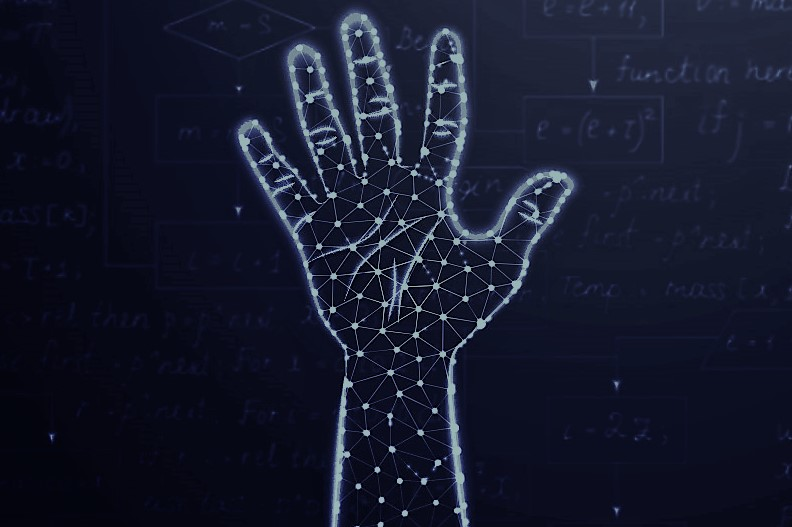

# Hand-Gesture-Recognition

## A machine learning basesd hand gesture classifier

<h2 style="display:inline">📝 Table of Contents</h2>

- [Built With](#built-with--)
- [Getting started](#getting-started)
- [Description](#description)
- [Project Pipeline](#pipeline)

<h2 href="#BuiltWith">Built With </h2>
 <ul>
  <li><a href="https://www.python.org/">Python</a></li>
  <li><a href="https://pypi.org/project/opencv-python/">CV2</a></li>
  <li><a href="https://docs.python.org/3/library/pickle.html">Pickle</a></li>
   <li><a href="https://docs.python.org/3/library/argparse.html">argparse</a></li>
  <li><a href="https://numpy.org/">NumPy</a></li>
  <li><a href="https://scikit-image.org/">Skimage</a></li>
  <li><a href="https://scikit-learn.org/">Skilearn</a></li>
  <li><a href="https://docs.python.org/3/library/os.html">OS Python Library</a></li>
  <li><a href="https://docs.python.org/3/library/time.html">Time Python Library</a></li>
 </ul>

<h2 href="#GettingStarted">Getting Started</h2>
<blockquote>
  
This is a list of needed steps to set up your project locally, to get a local copy up and running follow these instructions.
 

</blockquote>
<ol>
  <li><strong><em>Clone the repository</em></strong>
    

        <code>$ git clone https://github.com/Waer1/Hand-Gesture-Recognition</code>
    

  </li>
  <li><strong><em>Install Pip and Python</em></strong>
    

        <h4>Follow this article to install Pip and Python <a href="https://phoenixnap.com/kb/install-pip-windows">Install Pip and Python</a></h4>
    

  </li>
  <li><strong><em>Install dependencies</em></strong>
    

        <h4>Please refer to previous Built With list to install all needed libraries</h4>
    

  </li>
  <li><strong><em>Train the model</em></strong>
    

        <code>$ py .\FinalCode\main.py --feature 0  --model 0 </code>
         
        <strong><em>Note: You should put the images under a folder named <code>Dataset</code> under the main folder <code>Hand-Gesture-Recognition</code></em></strong>
    

  </li>
  
  <li><strong><em>Test the model and performance analysis</em></strong>
    

        <code>$ py .\FinalCode\app.py --feature 0 </code>
         
        <strong><em>Note: You should put the images under a folder named <code>data</code> under the main folder <code>Hand-Gesture-Recognition</code></em></strong>
    

  </li>

</ol>

<h2 href="#Description">Description</h2>

<blockquote style="font-size: 15px; font-weight: 500">
  

    Hand gesture recognition has become an important area of research due to its potential applications in various fields such as robotics, healthcare, and gaming. The ability to recognize and interpret hand gestures can enable machines to understand human intentions and interact with them more effectively. For instance, in healthcare, hand gesture recognition can be used to control medical equipment without the need for physical contact, reducing the risk of infection. In gaming, it can enhance the user experience by allowing players to control games using hand gestures instead of traditional controllers. Overall, hand gesture recognition has immense potential to revolutionize the way we interact with machines and improve our daily lives.
  

</blockquote>

<h2 href="#Pipeline">Project Pipeline</h2>

<blockquote style="font-size: 15px; font-weight: 500">
  

    You can also look at it at <code>./Documentation/Project Pipeline.drawio</code>
  

</blockquote>

